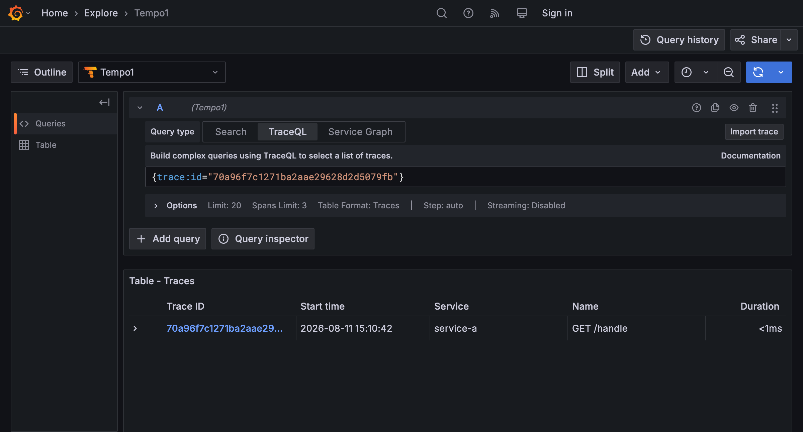
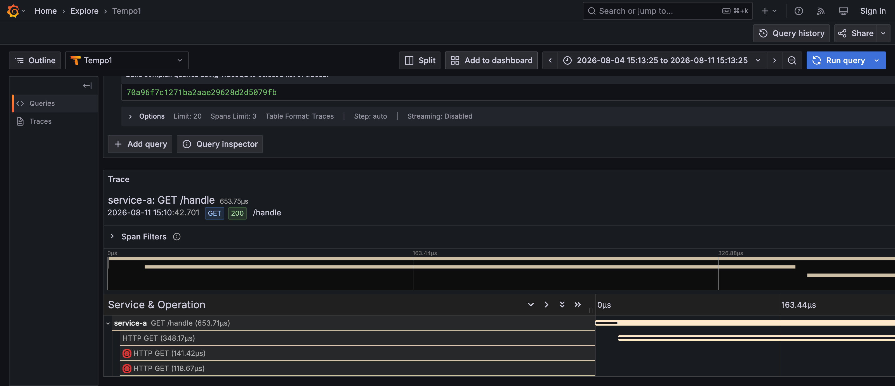
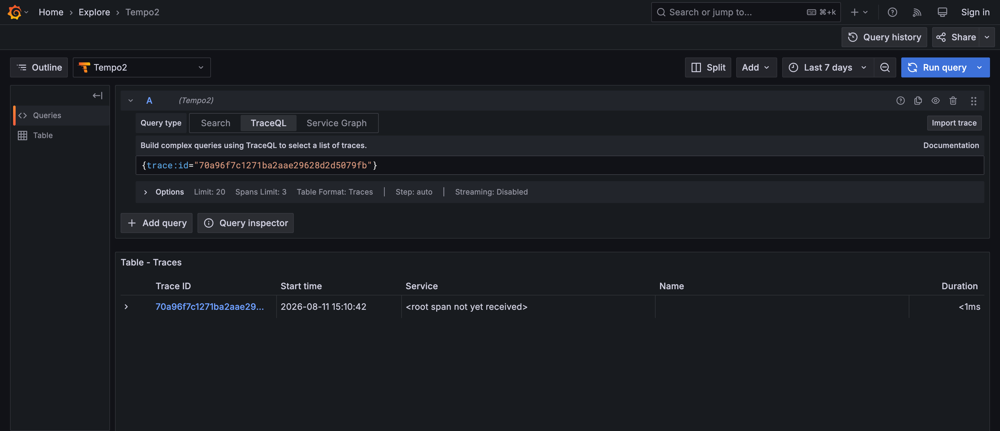
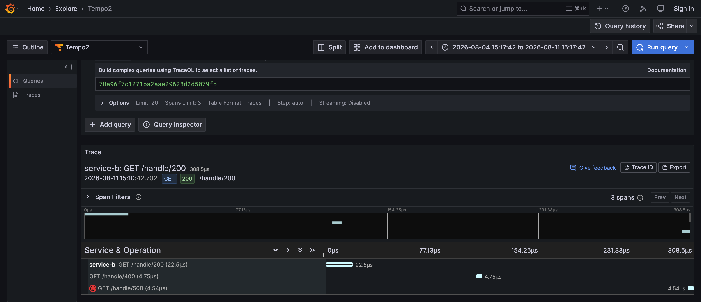

# 単一トレースのspanが別々のGrafana Tempoに送信された場合の表示検証レポート

## 目的

マイクロサービス構成などで、同一トレースに属するspanが誤って（あるいは意図せず）別々のGrafana Tempoバックエンドに送信されてしまった場合、Grafana UI（Explore画面）上でそのトレースがどのように見えるかを実際に確認する。あわせて、トレース内に成功・エラーが混在するケースで、エラーステータスの見え方が分割されたバックエンド間でどう変わるかも確認する。

## 検証環境の構成

`experiment/tempo-split-trace/` に、他のいかなるリソースにも依存しない独立したdocker-compose環境を構築した。

- **tempo1** / **tempo2**: `grafana/tempo:latest` を2台、完全に独立したストレージ（それぞれ専用のdocker volume）で起動。相互に一切通信・連携しない。
- **grafana**: `grafana/grafana:latest` を1台起動し、`Tempo1` (→tempo1) と `Tempo2` (→tempo2) の2つのTempoデータソースをprovisioning。
- **client**: OpenTelemetryの計装を一切持たない素のHTTPクライアント。`service-a` にリクエストを送るだけでspanは生成しない。`docker compose run --rm client` で都度1トレース分のリクエストを送るジョブとして構成されている（`docker compose up -d` では自動起動しない）。
- **service-a**: HTTPサーバ役。`client` からのリクエストを受けて自身のspan（`GET /handle`、`otelhttp` による自動計装。`client` は `traceparent` を送らないため、このspanがtraceのroot span）を開始する。続けて `service-b` の3つのエンドポイント（`/handle/200`, `/handle/400`, `/handle/500`）へ、`traceparent` ヘッダでトレースコンテキストを伝播しながら順番に1回ずつHTTPリクエストを送る。自身のspan（root spanと、3回分のHTTPクライアントspan、計4 span）は **tempo1** へOTLP exportする。
- **service-b**: HTTPサーバ役。受信したリクエストから伝播されたトレースコンテキストを抽出し、エンドポイントごとに固定のHTTPステータス（200 / 400 / 500）を返す3つのサーバspan（`GET /handle/200`, `GET /handle/400`, `GET /handle/500`）を生成する。これらのspanは **tempo2** へOTLP exportする。

```
client --HTTP--> service-a --HTTP(trace伝播)x3--> service-b
(spanなし)         (span→tempo1, 4 span)              (span→tempo2, 3 span)
```

これにより、「同一trace ID・正しいparent/child関係を持つが、エクスポート先のバックエンドが異なる」という状況を、実際の2サービス間通信の形で再現した。加えて、`service-b` の3エンドポイントがそれぞれ200/400/500を返すため、1本のトレース内に成功・エラーが混在する。

## 使用したtrace ID・送信方法

- 実行: `docker compose run --rm client`（`service-a` / `service-b` は現在の実装であらかじめビルド・起動済みの状態）
- 生成されたtrace ID: `70a96f7c1271ba2aae29628d2d5079fb`
- 標準出力:
  ```
  service-a handled request, called service-b 3 times:
  /handle/200 -> status=200 body=handled by service-b (200)
  /handle/400 -> status=400 body=handled by service-b (400)
  /handle/500 -> status=500 body=handled by service-b (500)
  TRACE_ID=70a96f7c1271ba2aae29628d2d5079fb
  ```
- 送信直後、Tempo API (`/api/traces/{traceID}`) を直接叩いて事前確認したところ、想定通り分割されていた:
  - tempo1側 (`localhost:3200`): `service-a` の4 span — root `GET /handle`（`SPAN_KIND_SERVER`、`parentSpanId`なし）と、その子である3つの `HTTP GET`（`SPAN_KIND_CLIENT`）。3つの子spanのうち2つ（`/handle/400`, `/handle/500` 相当の呼び出し）にエラーステータスが付与されていた
  - tempo2側 (`localhost:3201`): `service-b` の3 span（`GET /handle/200`, `GET /handle/400`, `GET /handle/500`）。それぞれの `parentSpanId` はtempo1側の対応する `HTTP GET` spanのIDと一致。エラーステータスが付与されていたのは `GET /handle/500` の1つのみ

## Grafana UI上での表示結果

実装コンテキストを持たない独立した検証者（ブラウザ自動操作エージェント。Grafana Explore URL・データソース名・trace ID・TraceQLクエリの書式のみを渡し、実装の詳細や期待される結果は一切伝えていない）が、Grafana Explore画面 (`http://localhost:3001/explore`) で各データソースを選択し、TraceQLクエリ `{trace:id="70a96f7c1271ba2aae29628d2d5079fb"}` で同一trace IDを検索して得た観察結果。

### Tempo1データソースでの表示

検索結果一覧: 1件ヒット。Trace ID `70a96f7c1271ba2aae29628d2d5079fb`、Service `service-a`、Name `GET /handle`、Duration `<1ms`。プレースホルダ表示なし。



トレース詳細（waterfall）画面:

- ヘッダ: `service-a: GET /handle 653.75μs`（`GET` / `200` バッジ、path `/handle`）
- Span Filtersのカウンタ表示: **「4 spans」**
- span tree: `service-a GET /handle`（親, 653.71μs） → `HTTP GET` x3（子, 348.17μs / 141.42μs / 118.67μs）
  - 3つの子spanのうち2つ（141.42μs, 118.67μs）に赤い丸のエラーアイコンが表示されている（`/handle/400`, `/handle/500` を呼び出したspanに相当）
- エラーバナー・「no data」表示なし
- `HTTP GET` クライアントspanで木構造が止まっており、その先（本来子であるはずの `service-b` 側のspan）は一切表示されない



### Tempo2データソースでの表示

検索結果一覧: 1件ヒット。Trace ID `70a96f7c1271ba2aae29628d2d5079fb`だが、**Service欄が `<root span not yet received>`**、Name欄は空、Duration `<1ms` という特殊な表示。



トレース詳細（waterfall）画面:

- ヘッダ: `service-b: GET /handle/200 308.5μs`（`GET` / `200` バッジ、path `/handle/200`）
- Span Filtersのカウンタ表示: **「3 spans」**
- span tree: `service-b GET /handle/200`（22.5μs） → `GET /handle/400`（4.75μs）、`GET /handle/500`（4.54μs、赤いエラーアイコンあり）が子として表示される
  - 実際には3 spanとも `parentSpanId` を持たず（親はいずれもtempo1側のspan）、tempo2バックエンド内では互いに兄弟関係だが、waterfall UI上は便宜的にそのうち1つ（`/handle/200`）が「root」として選ばれ、残り2つがその子であるかのようにインデントされて描画される
  - エラーアイコンが付いているのは `GET /handle/500` のみ。`GET /handle/400` にはエラーアイコンが付いていない
- エラーバナー・「no data」表示なし



## 考察

1. **各Tempoは完全にサイロ化されたビューしか持たない**
   2つのTempoインスタンスの間には一切の連携機構がなく、それぞれが「自分が受信したspanだけ」で完結したトレースを再構築して表示する。Tempo1はservice-a側の4 spanだけの（本来より短い）トレースとして、Tempo2はservice-b側の3 spanだけのトレースとして、**互いに矛盾なく・エラーも出さずに**表示してしまう。ユーザーが片方のデータソースしか見ていない場合、トレースが分割されて別バックエンドに存在するという事実に気づく手段がない。

2. **「root span not yet received」というUIヒントが唯一の分割の兆候**
   トレース詳細のwaterfall画面自体にはエラーや欠損を示す表示は一切現れないが、Explore検索結果一覧の段階でのみ、Tempo2側に `<root span not yet received>` というラベルが表示された。これはTempoがトレースの「ルートspan」を把握するための別APIを持っており、それを保持していないバックエンドに対して検索結果一覧上でのみ警告的なラベルを出す、というGrafana Tempo datasourceプラグインの挙動によるものと考えられる。裏を返せば、**ルートspanを保持している側（今回のTempo1）にはこの警告は一切表示されない**ため、「一部だけ見えている」ことに気づくヒントはさらに乏しい。

3. **エラーの見え方も分割されたバックエンド間で食い違う**
   `service-b` への3呼び出しのうち200/400/500の3ステータスを混在させたところ、Tempo1側（`service-a` のHTTPクライアントspan）では400と500の**2つ**がエラー扱いで赤いアイコン付きで表示されたのに対し、Tempo2側（`service-b` のHTTPサーバspan）ではエラー扱いになったのは500の**1つだけ**だった。これはOpenTelemetryのHTTP計装が、クライアントspanでは4xx/5xxの両方を（呼び出し側から見た）失敗として扱う一方、サーバspanでは5xx（サーバ自身の障害）のみをエラーとして扱う、という一般的な計装規約の違いによるものと考えられる。この違い自体は各Tempo単体では正しい挙動だが、**片方のバックエンドだけを見て障害調査をすると「エラーは1件だけ」という誤った印象を持ちかねない**。

4. **Tempo2のwaterfallは、親を持たない兄弟spanの1つを恣意的に「root」として描画する**
   Tempo2が受信した3 spanはいずれもこのバックエンド内では親spanを持たない（真の親はtempo1側にある）ため、本来は3つとも同格のはずである。しかしwaterfall UIはそのうち1つ（今回は `/handle/200`）を見た目上のrootとして選び、残り2つをその子であるかのようにインデントして表示した。これは実際のトレース構造（親子関係）を誤解させかねないUI上の挙動であり、分割されたトレースを調査する際にさらなる混乱要因となり得る。

5. **運用上の含意**
   - otel-collectorのルーティング設定ミス、複数チームでTempoを個別運用している環境、移行作業中の二重書き込みなど、同一トレースのspanが複数バックエンドに分散し得るシナリオは現実的にあり得る。
   - このような状態は、各Tempo単体では「正常に動作しているように見える」（エラーもwarningも出ない）ため、**サービス間のレイテンシ問題やエラーの根本原因調査時に、実際には全体像の一部しか見ていないことに気づかないまま調査が進んでしまうリスク**がある。
   - 特に、エラー件数の見え方までバックエンドごとに異なり得るため、**「エラーが少ない方のバックエンドだけを見て問題なしと判断してしまう」リスク**も実際にあり得ることが確認できた。
   - 唯一の手がかりである `<root span not yet received>` ラベルも、ルートspanを持たない側のデータソースを能動的に確認しない限り目に入らないため、見落としやすい。
   - 対策としては、単一のTempoバックエンド（またはTempoのマルチテナント/フェデレーション機能）にトレースを集約する、あるいはotel-collectorのエクスポート設定を一元管理・監査する運用が望ましい。

## 検証方法の独立性について

上記「Grafana UI上での表示結果」は、環境構築や実装の詳細を一切知らない別セッションのエージェント（`general-purpose` サブエージェント、ブラウザ自動操作用のMCPツールを使用）に、Grafana URL・対象trace ID・データソース名・TraceQLクエリの書式のみを渡して独立に観察させ、検索結果一覧・トレース詳細画面それぞれのスクリーンショットを撮影させたものである。実装側（本レポート作成者）が期待する結果を伝えていないため、観察結果は実際の挙動をそのまま反映している。
